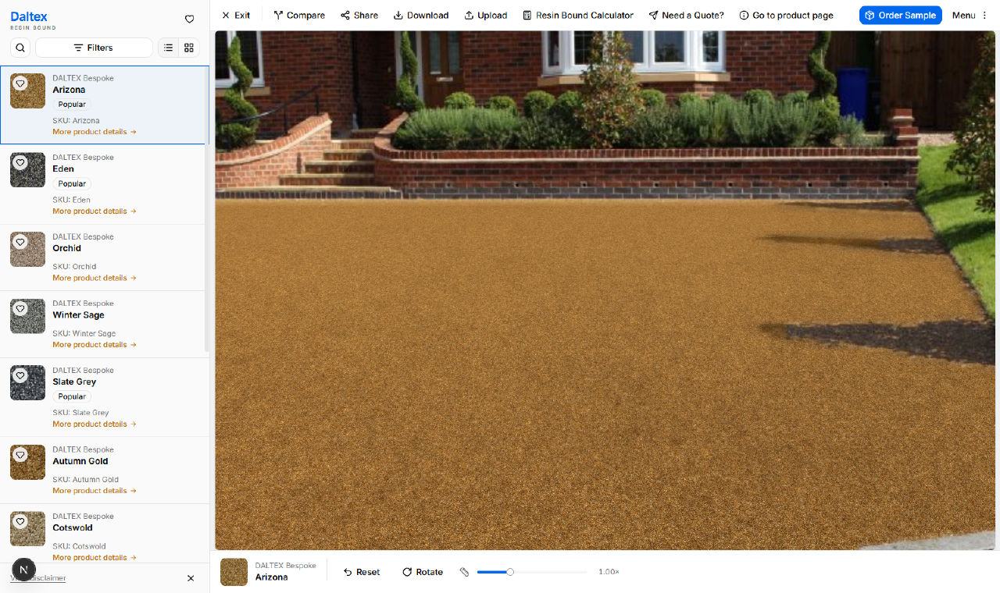
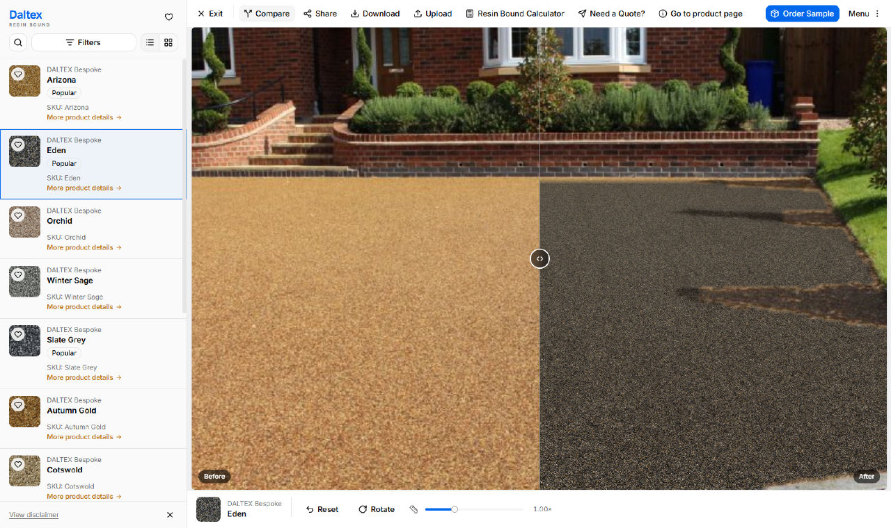
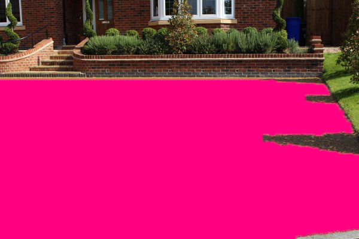
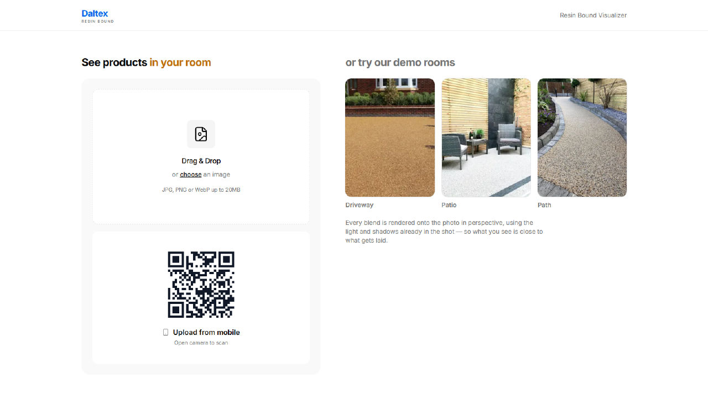
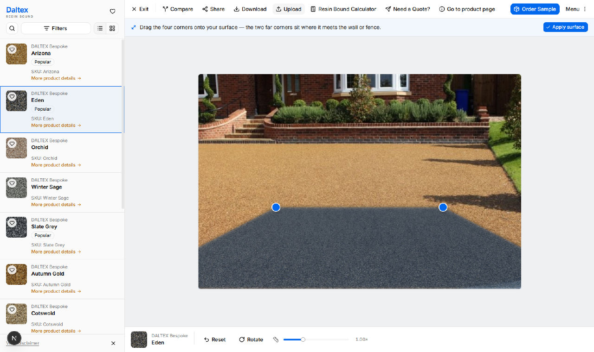

# Resin Bound Visualizer

A web app that lays any resin bound aggregate blend onto a photograph of a real
driveway, patio or path — in correct perspective, under the light that was
already in the shot.

Customers either upload a photo of their own property (from the desktop, or from
their phone via a QR code) or start from one of three demo rooms, then browse the
catalogue and watch each blend land on the surface.



---

## Contents

- [What makes it look real](#what-makes-it-look-real)
- [Getting started](#getting-started)
- [Testing the phone hand-off](#testing-the-phone-hand-off)
- [Project structure](#project-structure)
- [Working with the catalogue](#working-with-the-catalogue)
- [Working with demo scenes](#working-with-demo-scenes)
- [Before going to production](#before-going-to-production)
- [Browser support](#browser-support)
- [Scripts](#scripts)
- [Tech stack](#tech-stack)

---

## What makes it look real

The central idea is that **the new surface only supplies colour**. Everything
else — the sun, the shadow the hedge throws across the drive, the fall-off toward
the house — is lifted out of the original photograph and multiplied back over the
aggregate. Nothing is relit, so nothing looks pasted on.



Three pieces do the work.

### 1. Knowing where the surface is

Each demo photo ships with a segmented mask rather than a hand-drawn polygon.
`scripts/generate-masks.js` runs a flood fill in CIELAB from a handful of seed
points, with a deliberately asymmetric tolerance:

- **tight on chroma** — hue is what identifies the material, so grass, brick and
  slate chippings are rejected;
- **loose on lightness** — sunlight and shadow fall across the same surface, and
  a shadowed corner is still the surface.

The result is cleaned up with a morphological close/open, hole filling and a
largest-component pass, then eroded a hair and feathered so the seam reads as a
contact edge rather than a cutout.



Uploaded photos have no mask, so the user marks the surface out by dragging four
corners. The same quad supplies both the mask and the perspective.

### 2. Knowing what gets laid

Blends are defined by **the stones in them**, not by a photograph of a sample
board — see `lib/products.ts`. Each is a weighted palette plus an average grain
size, and `lib/texture/aggregate.ts` synthesises the surface from that with a
jittered-grid Worley pattern: every cell becomes one angular stone, shaded as a
shallow dome with a wobbling rim, over a darker binder in the seams.

Two things fall out of this that a tiled swatch photo cannot give you:

- stone size stays **physically correct at any camera distance**, because the
  tile covers a known 0.5 m of real surface (`FLOOR_TILE_METRES`);
- the grid wraps, so the texture tiles seamlessly and never shows a visible
  repeat.

The same generator draws the sidebar swatches, so a swatch and the laid surface
can never drift apart.

### 3. Compositing

`lib/render/surface-renderer.ts` is a single WebGL2 pass:

1. An inverse homography (`lib/render/homography.ts`, Heckbert's unit-square
   mapping) turns each pixel into a position in metres on the ground plane.
2. That position samples the tiling aggregate, with a small negative mip bias to
   keep grain legible under the heavy minification perspective forces, plus a
   very low-frequency second read for the patchiness real laid surfaces have.
3. A 96-pixel downsample of the photo acts as the lighting field. Downsampling
   *is* the low-pass — it keeps the sun and shadows but discards the grain of
   whatever surface is there now, which is what stops the old texture printing
   through the new one.
4. Ambient colour cast and the photo's own micro-contrast are added back, and
   the result is blended through the mask.

Everything past the horizon is rejected by a single sign test on the homogeneous
coordinate.

---

## Getting started



**Requirements**

- Node.js 20.9 or newer (developed on 22.16)
- A browser with WebGL 2 — see [Browser support](#browser-support)

```bash
npm install
npm run dev
```

Open <http://localhost:3000>.

To run the production build locally:

```bash
npm run build
npm start
```

---

## Testing the phone hand-off

The QR code on the landing screen encodes `window.location.origin`. If you load
the app on `localhost`, the QR points at the phone's *own* localhost and will not
resolve. Bind the dev server to every interface and open the LAN address on the
desktop too:

```bash
npx next dev -H 0.0.0.0
# then open http://<your-lan-ip>:3000 on the desktop, not localhost
```

Windows will usually ask for a firewall exception the first time; allow it on the
private network. Scan the code, take a photo, tap **Send to computer** — the
desktop polls every two seconds and drops straight into the corner editor.



---

## Project structure

```
app/
  page.tsx                     Landing screen — upload or pick a demo room
  visualizer/page.tsx          The visualizer
  m/[id]/page.tsx              Mobile capture page reached from the QR code
  api/handoff/[id]/route.ts    Phone to desktop photo channel
  api/enquiries/route.ts       Sample and quote requests

components/
  picker/                      Dropzone, QR card, mobile capture
  visualizer/                  Sidebar, toolbar, stage, dialogs
  ui/                          shadcn/ui primitives (Base UI)

lib/
  products.ts                  Blend catalogue
  scenes.ts                    Demo photos, masks and ground-plane geometry
  texture/aggregate.ts         Procedural aggregate generator
  render/homography.ts         Unit square to quadrilateral mapping
  render/surface-renderer.ts   The WebGL2 compositor
  image.ts                     Upload normalisation, quad to mask
  session.ts                   Chosen room, in sessionStorage
  favourites.ts                Saved blends, as an external store

scripts/generate-masks.js      Segments the demo photos into masks
public/demo/                   Demo photos and their generated masks
```

---

## Working with the catalogue

Add a blend by appending to `PRODUCTS` in `lib/products.ts`. No image assets are
involved — the swatch and the laid surface are both generated from the entry:

```ts
{
  id: "harbour-grey",
  brand: "DALTEX Bespoke",
  name: "Harbour Grey",
  sku: "Harbour Grey",
  family: "Grey & Silver",       // drives the Filters panel
  stoneSize: "2-5mm",            // drives the Filters panel
  grainMm: 3.3,                  // average stone diameter, sets the grain
  stones: [                      // weights are relative, not percentages
    { color: "#7d8288", weight: 5 },
    { color: "#c9ccce", weight: 3 },
    { color: "#2f3336", weight: 2 },
  ],
  binder: "#2b2e32",             // resin tint showing in the seams
  gloss: 0.35,                   // 0-1, strength of the specular highlight
  description: "Cool harbour greys with a bright fleck.",
}
```

Adding a new `family` or `stoneSize` also means adding it to `COLOUR_FAMILIES` or
`STONE_SIZES` in the same file so the filters pick it up.

Tiles are generated lazily and cached per blend, and the blends marked `popular`
are pre-warmed on idle.

---

## Working with demo scenes

A demo scene needs a photo, a mask and a ground-plane reference rectangle.

**1. Add the photo** to `public/demo/`.

**2. Add a config block** to `SCENES` in `scripts/generate-masks.js`. Seeds are
normalised points that are definitely on the surface; the tolerances are the
knobs worth turning:

```js
{
  file: "courtyard.jpg",
  seeds: [[0.5, 0.8], [0.25, 0.85], [0.8, 0.75]],
  chromaTol: 12,        // raise to accept more hues - leaks into grass/brick
  lightTolDown: 58,     // raise to reach into shadow
  lightTolUp: 30,
  bounds: [0, 0.55, 1, 1],  // restrict the fill to the lower part of the frame
  close: 3, open: 3,    // raise `open` to sever thin leaks, e.g. up a chair leg
  shrink: 1, feather: 2,
}
```

**3. Generate and check it.** Setting `MASK_DEBUG_DIR` also writes a
mask-over-photo overlay so you can eyeball the result:

```bash
npm run masks
MASK_DEBUG_DIR=./tmp npm run masks   # also writes *-overlay.png
```

**4. Register the scene** in `DEMO_SCENES` (`lib/scenes.ts`) with its `quad` and
`planeMetres`. The quad is the ground plane, not the visible surface, so its
corners usually sit outside the frame — order is far-left, far-right, near-right,
near-left, mapping to `(0,0) (1,0) (1,1) (0,1)`.

The quads are derived by estimating the horizon from a known vertical in the shot
(a wall of known height, a chair seat at roughly 0.45 m), placing the vanishing
point, and reading the depth off `d ∝ 1 / (y − y_horizon)`. Small errors are
harmless — the scale slider corrects the absolute stone size, and foreshortening
comes out right regardless.

---

## Before going to production

Two pieces are deliberately unfinished and clearly marked in the code:

| Where | Current behaviour | What it needs |
| --- | --- | --- |
| `app/api/handoff/[id]/route.ts` | Photos are held in an in-memory `Map` with a 10-minute TTL, single use | Redis or blob storage — anything more than one server instance will drop hand-offs. The route contract does not change. |
| `app/api/enquiries/route.ts` | Validates the payload and logs it | Point `deliver()` at the CRM or order system. |

Other things worth knowing:

- Uploads are downscaled to a 1600px long edge and capped at 20 MB
  (`lib/image.ts`); the hand-off endpoint caps the posted data URL at 8 MB.
- Uploaded photos never leave the browser except through the QR hand-off, which
  is why the share dialog offers the image rather than a link to it.
- The calculator uses 1600 kg/m³ for compacted aggregate and doses resin at 6.5%
  of aggregate weight, in 25 kg bags and 7.5 kg kits. Confirm these against your
  own specification before publishing.
- The on-screen disclaimer about screen colour versus laid product is in
  `components/visualizer/product-sidebar.tsx`.

---

## Browser support

The compositor requires **WebGL 2**, which rules out very old browsers and some
locked-down enterprise configurations. If the context cannot be created the app
says so rather than showing a blank canvas.

Note for contributors: `SurfaceRenderer.dispose()` releases its GL objects but
deliberately **does not** call `loseContext()`. A canvas hands back the same
context object forever, including after it has been lost, and React Strict Mode
mounts, unmounts and remounts every component in development — losing the context
on cleanup leaves the remounted renderer with a dead one, and every WebGL call
then fails silently.

---

## Scripts

| Command | What it does |
| --- | --- |
| `npm run dev` | Development server on port 3000 |
| `npm run build` | Production build |
| `npm start` | Serve the production build |
| `npm run lint` | ESLint |
| `npm run masks` | Regenerate the demo masks from the photos in `public/demo/` |

---

## Tech stack

- **Next.js 16** (App Router, Turbopack) and **React 19**
- **TypeScript**
- **Tailwind CSS 4** with **shadcn/ui** on **Base UI** primitives
- **WebGL 2** for the compositor; Canvas 2D for texture and mask generation
- `qrcode` for the hand-off code; `jpeg-js` in the mask script (build-time only)

Everything that renders the surface — the aggregate, the masks, the perspective —
is computed in this repository. There are no third-party rendering services and
no image assets beyond the three demo photographs.
